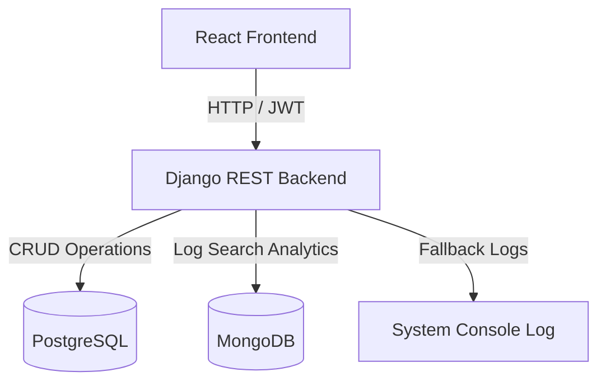

# Smart Store E-Commerce Platform

Welcome to the **Smart Store** repository. This project is a modern, state-of-the-art e-commerce application designed to streamline daily shopping with integrated inventory management, an AI-powered chatbot assistant, customer loyalty tiers, and demand intelligence analytics.

The application is split into a **Django REST Framework (DRF) backend** and a **React (Vite) frontend**. It uses a dual-database architecture: **PostgreSQL** for transactional e-commerce data and **MongoDB** for logging unfulfilled search intent.

---

## 🔑 Administrative Credentials

For local development and administrative testing, use the following credentials to access the Store Operations Manager dashboard:

> [!IMPORTANT]
> **Admin User ID (Email):** `admin@example.com`  
> **Password:** `admin123`

*Note: These credentials allow full access to catalog management, order fulfillment, customer directory views, and demand intelligence dashboards.*

---

## 🏗️ Architecture & Database Setup

Smart Store employs a dual-database strategy to optimize transaction handling and analytics processing:
1. **PostgreSQL (Primary Transactional DB):** Handles core entities such as users, addresses, OTP codes, categories, products, product variants, inventory records, cart items, order headers/items, loyalty accounts, and notifications.
2. **MongoDB (Analytical DB):** Log unfulfilled search queries (i.e. "Demand Intelligence") when customers search for items not found in stock or not present in the catalog. This operates with a safe fallback mechanism—if MongoDB is down, the system degrades gracefully and logs fallbacks without crashing the user flow.



---

## 📁 Repository Directory Structure

Below is an overview of the workspace folders and files:

```
Mini-project-1/
├── backend/                   # Django REST Framework Backend
│   ├── manage.py              # Django CLI utility
│   ├── config/                # Main project configuration (settings, routing, WSGI/ASGI)
│   ├── accounts/              # User profiles, addresses, OTP validation, and admin auth
│   ├── products/              # Product catalog (categories, products, variants, and seed commands)
│   ├── inventory/             # Stock tracking, transaction logging, and stock adjustment
│   ├── cart/                  # Customer shopping cart items
│   ├── orders/                # Checkout pipeline and status transitions (NEW -> PROCESSING -> SHIPPED -> etc.)
│   ├── loyalty/               # Points calculation, credit/debit tracking, and customer tiers
│   ├── notifications/         # Real-time alert logs and mock email notifications
│   ├── chatbot/               # AI chatbot orchestration for automated orders, cancelation, and FAQs
│   └── analytics/             # MongoDB aggregation of unfulfilled customer search terms
├── frontend/                  # React (Vite) Frontend
│   ├── package.json           # Node dependencies and scripts
│   ├── index.html             # Application root HTML
│   └── src/
│       ├── main.jsx           # ReactDOM bootstrap
│       ├── App.jsx            # Routing configuration (customer routes & admin dashboard)
│       ├── index.css          # Design system stylesheet
│       ├── context/           # React contexts (AuthContext, CartContext)
│       ├── components/        # Reusable elements (Header, Footer, AuthModal, ChatbotWidget)
│       ├── customer/          # Customer pages (Home, Shop, Details, Cart, Checkout, History, Loyalty)
│       └── admin/             # Operations manager views (Dashboard, Products, QuickStock, Orders, Customers, Analytics)
├── .env                       # Environment variables configuration
└── requirements.txt           # Python dependencies
```

---

## ⚙️ Backend Component & File Breakdown

### 1. `config/`
*   **[settings.py](file:///d:/Project/Mini-project-1/backend/config/settings.py):** Main project settings, middleware definitions (like CORS), database parameters (PostgreSQL & MongoDB connection strings), SimpleJWT configuration, and custom user model mapping (`AUTH_USER_MODEL = 'accounts.User'`).
*   **[urls.py](file:///d:/Project/Mini-project-1/backend/config/urls.py):** Routes requests to `/admin/` (Django native admin panel) and redirects `/api/...` sub-paths to respective application modules.

### 2. `accounts/` (Authentication & Profile Management)
*   **[models.py](file:///d:/Project/Mini-project-1/backend/accounts/models.py):** Custom `User` model utilizing email as the primary key. Houses the `Address` model (managing delivery locales) and the `OTPCode` model (short-lived login/signup verification codes).
*   **[services.py](file:///d:/Project/Mini-project-1/backend/accounts/services.py):** Encapsulates signup requests, OTP generation, token verification, and logins (both customer logins and `admin_login` checks enforcing `is_staff` privileges).
*   **[views.py](file:///d:/Project/Mini-project-1/backend/accounts/views.py):** Standardized API view interfaces for customer signup, customer login, request OTP, verify OTP, address CRUD, admin login, and customer directory listing.
*   **[urls.py](file:///d:/Project/Mini-project-1/backend/accounts/urls.py):** Exposes routes like `/api/accounts/signup/`, `/api/accounts/otp/request/`, and `/api/accounts/admin/login/`.

### 3. `products/` (Catalog Management)
*   **[models.py](file:///d:/Project/Mini-project-1/backend/products/models.py):** Models for `Category`, `Product` (linked to a category), and `ProductVariant` (mapping sizes/packs, and tracking price and inventory link).
*   **[views.py](file:///d:/Project/Mini-project-1/backend/products/views.py):** Admin-protected endpoints to create/modify catalog items, alongside public endpoints allowing users to list categories, browse products, and read detail specifications.
*   **[seed_data.py](file:///d:/Project/Mini-project-1/backend/products/management/commands/seed_data.py):** Custom Django management command. Run `python manage.py seed_data` to auto-populate categories, products, variants, and receive initial stock records into the inventory tables.

### 4. `inventory/` (Stock Tracking)
*   **[models.py](file:///d:/Project/Mini-project-1/backend/inventory/models.py):** `InventoryRecord` tracks current stock totals, and `InventoryTransaction` records history of stock activities (`RECEIVED`, `SHIPPED`, `ADJUSTED`).
*   **[views.py](file:///d:/Project/Mini-project-1/backend/inventory/views.py):** Restricted endpoints permitting staff to perform stock-takes, log supply receipts, and inspect transactions.

### 5. `cart/` (Shopping Basket)
*   **[models.py](file:///d:/Project/Mini-project-1/backend/cart/models.py):** Tracks ongoing customer cart states via `Cart` and `CartItem` linked to specific `ProductVariant`s.

### 6. `orders/` (Sales & Status Engine)
*   **[models.py](file:///d:/Project/Mini-project-1/backend/orders/models.py):** Contains `Order` (holding totals, addresses, payment detail, status, and delivery ETAs) and `OrderItem` (capturing purchase-time pricing).
*   **[services.py](file:///d:/Project/Mini-project-1/backend/orders/services.py):** Orchestrates the transactional order placement checklist (checking stock availability, debiting inventory, capturing totals, clearing user cart, awarding loyalty points) and manages status state-machine changes.
*   **[views.py](file:///d:/Project/Mini-project-1/backend/orders/views.py):** Endpoints for customer checkout and listing personal history, alongside operations endpoints (`/api/orders/admin-ops/`) allowing staff to update order statuses.

### 7. `loyalty/` (Retention Tiers)
*   **[models.py](file:///d:/Project/Mini-project-1/backend/loyalty/models.py):** Tracks `LoyaltyAccount` (balances, tiers, lifetime points) and logs reward transaction statements via `LoyaltyTransaction`.
*   **[services.py](file:///d:/Project/Mini-project-1/backend/loyalty/services.py):** Automates point increments (1 point awarded per ₹10 spent), point redemptions, and dynamically promotes customer membership status:
    *   **Bronze:** Default entry tier
    *   **Silver:** $\ge 500$ points
    *   **Gold:** $\ge 1500$ points
    *   **Platinum:** $\ge 5000$ points

### 8. `chatbot/` (Conversational UI)
*   **[services.py](file:///d:/Project/Mini-project-1/backend/chatbot/services.py):** Houses the `ChatOrchestrator` which parses incoming queries. Features rule-based logic to cancel orders, track shipments, lookup loyalty points, check cart values, compare products, and handle budget searches.
*   **[views.py](file:///d:/Project/Mini-project-1/backend/chatbot/views.py):** Processes conversations. Gracefully handles unauthenticated intents and logs unfulfilled queries straight into MongoDB analytics.

### 9. `analytics/` (Demand Intelligence)
*   **[services.py](file:///d:/Project/Mini-project-1/backend/analytics/services.py):** Interacts with MongoDB. `log_unfulfilled_search` writes documents into the `unfulfilled_queries` collection.
*   **[views.py](file:///d:/Project/Mini-project-1/backend/analytics/views.py):** Aggregates unfulfilled query documents via MongoDB pipelines, returning ranked terms to the store dashboard.

---

## 🎨 Frontend Component & File Breakdown

### 1. Global Setup & State Management
*   **[main.jsx](file:///d:/Project/Mini-project-1/frontend/src/main.jsx):** The mount point initializing the React application.
*   **[App.jsx](file:///d:/Project/Mini-project-1/frontend/src/App.jsx):** Setup of routes, routing rules, and path boundaries.
*   **[index.css](file:///d:/Project/Mini-project-1/frontend/src/index.css):** Houses CSS variables, styling systems, typography, and standard elements.
*   **[AuthContext.jsx](file:///d:/Project/Mini-project-1/frontend/src/context/AuthContext.jsx):** Provides login, signup, OTP verify hooks, tracks staff status, and stores state variables locally.
*   **[CartContext.jsx](file:///d:/Project/Mini-project-1/frontend/src/context/CartContext.jsx):** Syncs cart values, item additions/subtractions, and clears the cart on success.

### 2. Global Shared Components
*   **[Header.jsx](file:///d:/Project/Mini-project-1/frontend/src/components/Header.jsx):** Responsive customer navigation bar showing auth status and cart bubble badge.
*   **[Footer.jsx](file:///d:/Project/Mini-project-1/frontend/src/components/Footer.jsx):** Common footer, featuring a shortcut link to the Admin Operations Login.
*   **[AuthModal.jsx](file:///d:/Project/Mini-project-1/frontend/src/components/AuthModal.jsx):** Modal handling customer OTP signups and logins.
*   **[ChatbotWidget.jsx](file:///d:/Project/Mini-project-1/frontend/src/components/ChatbotWidget.jsx):** Sticky floating widget offering immediate e-commerce guidance.

### 3. Customer Portal Views
*   **[Home.jsx](file:///d:/Project/Mini-project-1/frontend/src/customer/Home.jsx):** Customer landing page showcasing hero banners, shop features, and promotional content.
*   **[Shop.jsx](file:///d:/Project/Mini-project-1/frontend/src/customer/Shop.jsx):** Main catalog grid. Features sidebar category filtering, search terms, and product links.
*   **[ProductDetail.jsx](file:///d:/Project/Mini-project-1/frontend/src/customer/ProductDetail.jsx):** Product landing view. Allows customers to compare price-variants, verify stock status, and add items to their cart.
*   **[Cart.jsx](file:///d:/Project/Mini-project-1/frontend/src/customer/Cart.jsx):** Interactive shopping basket listing totals, items, and checkout prompts.
*   **[Checkout.jsx](file:///d:/Project/Mini-project-1/frontend/src/customer/Checkout.jsx):** Multistep delivery checkout process for choosing shipping addresses, payment details, and estimated points.
*   **[OrderConfirmation.jsx](file:///d:/Project/Mini-project-1/frontend/src/customer/OrderConfirmation.jsx):** Purchase completion screen.
*   **[OrderHistory.jsx](file:///d:/Project/Mini-project-1/frontend/src/customer/OrderHistory.jsx):** Dashboard showing order tracking and history.
*   **[LoyaltyDashboard.jsx](file:///d:/Project/Mini-project-1/frontend/src/customer/LoyaltyDashboard.jsx):** Customer rewards status page showcasing tiers and point ledgers.

### 4. Admin Management Views
*   **[AdminLayout.jsx](file:///d:/Project/Mini-project-1/frontend/src/admin/AdminLayout.jsx):** Sidebar navigation layout housing operations views.
*   **[Login.jsx](file:///d:/Project/Mini-project-1/frontend/src/admin/Login.jsx):** Login screen for administrative credentials entry.
*   **[Dashboard.jsx](file:///d:/Project/Mini-project-1/frontend/src/admin/Dashboard.jsx):** Key statistics visualizer summarizing revenue metrics, active users, inventory counts, and pending order pipelines.
*   **[Products.jsx](file:///d:/Project/Mini-project-1/frontend/src/admin/Products.jsx):** Catalog management tool to create, update, or edit items and prices.
*   **[QuickStock.jsx](file:///d:/Project/Mini-project-1/frontend/src/admin/QuickStock.jsx):** Low stock management desk used to restock catalog variants and check transactions.
*   **[Orders.jsx](file:///d:/Project/Mini-project-1/frontend/src/admin/Orders.jsx):** Fulfillment screen. Allows administrators to transition statuses and track shipments.
*   **[Customers.jsx](file:///d:/Project/Mini-project-1/frontend/src/admin/Customers.jsx):** Lists registered customers, addresses, and customer profiles.
*   **[Analytics.jsx](file:///d:/Project/Mini-project-1/frontend/src/admin/Analytics.jsx):** Visualizes unfulfilled search analytics aggregated from MongoDB.

---

## 🚀 Running the Project Locally

Follow these instructions to start the development servers:

### 1. Prerequisites
Ensure you have the following installed on your machine:
*   [Python 3.10+](https://www.python.org/downloads/)
*   [Node.js 18+](https://nodejs.org/)
*   [PostgreSQL](https://www.postgresql.org/)
*   [MongoDB](https://www.mongodb.com/try/download/community) *(optional, but recommended for full search logging functionality)*

### 2. Backend Initialization
1. Navigate to the backend directory:
   ```powershell
   cd backend
   ```
2. Set up a Python virtual environment and activate it:
   ```powershell
   python -m venv venv
   # On Windows:
   .\venv\Scripts\activate
   ```
3. Install the required dependencies:
   ```powershell
   pip install -r ..\requirements.txt
   ```
4. Verify your database settings in the root `.env` file (ensure your PostgreSQL credentials match).
5. Apply database migrations:
   ```powershell
   python manage.py migrate
   ```
6. Seed the catalog with development data:
   ```powershell
   python manage.py seed_data
   ```
7. Start the backend development server:
   ```powershell
   python manage.py runserver
   ```
   *The API will be available at `http://localhost:8000/`.*

### 3. Frontend Initialization
1. Open a new terminal session and navigate to the frontend directory:
   ```powershell
   cd frontend
   ```
2. Install the required Node modules:
   ```powershell
   npm install
   ```
3. Start the Vite dev server:
   ```powershell
   npm run dev
   ```
   *The Web application will run at `http://localhost:5173/`.*
